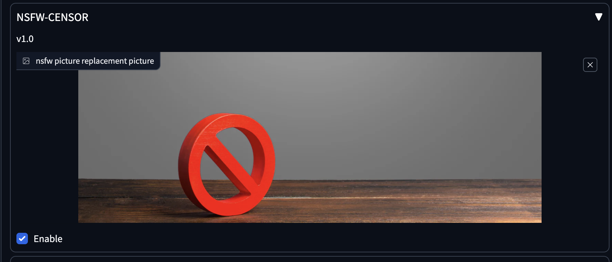

# NSFW Censor extension for StableDiffusion Webui

This repo makes it an extension of [AUTOMATIC1111](https://github.com/AUTOMATIC1111/stable-diffusion-webui/) or [Forge](https://github.com/lllyasviel/stable-diffusion-webui-forge) Webui.



## Installation

-   Clone this repo into `stable-diffusion-webui/extensions` folder.
-   Start the Webui.

## SD webui alwayson_scripts api

```python
alwayson_scripts = {
  "nsfw-censor": {
    "args": [
      # nsfw picture replacement picture
      get_base64_image('./replacement.png'),
      # Enable
      True
    ]
  }
}
```
